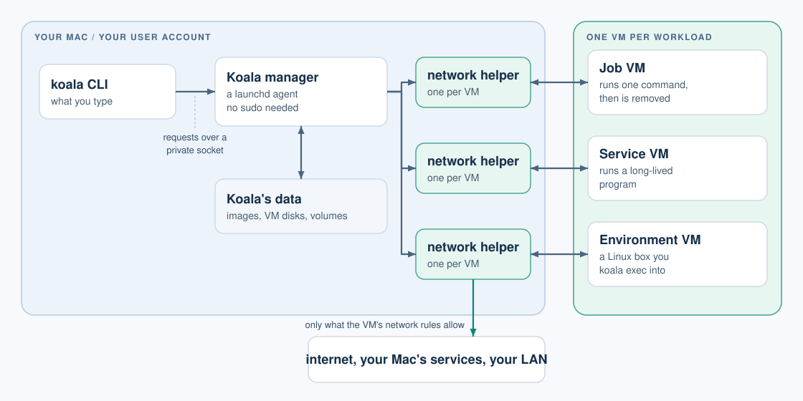

# Koala user guide

This guide matches Koala 0.1.0-preview.1. The latest release is on the [releases page](https://github.com/kunalkushwaha/koala-releases/releases).

This guide is for macOS developers who use the `koala` command line. It
explains how to run jobs, services and development environments in Koala
VMs.
Koala is in preview: `0.1.0-preview.1` is published, and v0.1 is in
development. This guide describes only what works today, and marks anything
that is planned but not built yet.

## What Koala is

Koala runs each of your Linux workloads in its own lightweight virtual
machine on your Mac:

- **One VM per environment.** Each job, service or development environment
  gets its own ARM64 Linux VM, with its own kernel, disk and network stack.
  VMs do not share a network with each other.
- **A CLI and a background manager.** You type `koala` commands. A per-user
  manager (a launchd agent) keeps track of VMs and keeps them running after
  your terminal closes. No `sudo` is needed for everyday use.
- **Two guest profiles.** *Lean* VMs run one OCI image (a Docker-style
  image) with a minimal init. *Full* VMs run a Linux distribution with
  systemd and Docker Engine.

Each VM has its own kernel and disk, and a network helper on the Mac that
checks every connection it makes.

## What Koala promises, and what it does not

Koala gives a workload **only the access you grant**:

- No host files, except directories you share explicitly. Shares are
  read-only unless you ask for read-write.
- No secrets, unless you grant a named secret to that VM.
- Internet access by default, but no access to your Mac's own services, your
  LAN or other VMs unless you grant it (internet can also be switched off).
- Published ports listen on `127.0.0.1` unless you ask for the LAN.

The VM, its guest kernel and everything running inside it are treated as
untrusted. Koala does **not** promise:

- To keep running after you log out of macOS, or across a reboot. See
  [limits](limits.md).
- To protect you from a compromised macOS, or from yourself: Koala trusts
  the logged-in user.
- That data the guest has already received can be taken back. Removing a
  secret or a share stops future access only.
- Dedicated CPU cores or a cap on total Mac memory use. See
  [limits](limits.md#memory-cpu-and-disk).

The security testing planned for release (adversarial guests, crash and
endurance qualification) is not finished yet.

## Requirements

- A Mac with Apple silicon.
- macOS 26 or newer.
- Images for `linux/arm64`. Intel (x86-64) images are not supported, and
  there is no Rosetta translation.

## Contents

1. [Getting started](getting-started.md): install, start the manager, and
   run a first job and a first VM.
2. [Jobs and VMs](vms.md): disposable jobs, persistent services and
   environments, VM spec files, and the VM lifecycle.
3. [Working inside a VM](working-in-vms.md): `exec`, terminals (`-it`),
   `attach`, `cp`, logs, the console, events and exit codes.
4. [Images and private registries](images.md): `image pull`, `registry
   login` and `logout`.
5. [Secrets](secrets.md): `secret set`, file and environment delivery, the
   login keychain and its approval prompt.
6. [Networking](networking.md): internet access, host services, the LAN and
   published ports.
7. [Shares, volumes and disks](storage.md): host directories, named
   volumes and disk sizes.
8. [Profiles: lean and full](profiles.md): systemd and Docker.
9. [Limits and behaviour](limits.md): logout, sleep, restarts, memory and
   disk, and what is not available yet.
10. [Troubleshooting](troubleshooting.md): error codes and what to do.

## Conventions in this guide

- `VM` is a VM's name or ID. A name must match exactly; if two VMs share a
  name, use the ID.
- Upper-case words such as `EXECUTION_ID` or `REGISTRY` are placeholders.
- Commands that change something accept `--wait`, so they return only when
  the change is finished. The examples use it. Without `--wait`, the command
  returns as soon as the manager has accepted the request.
- `--json` prints machine-readable output on stdout. Messages go to stderr.
