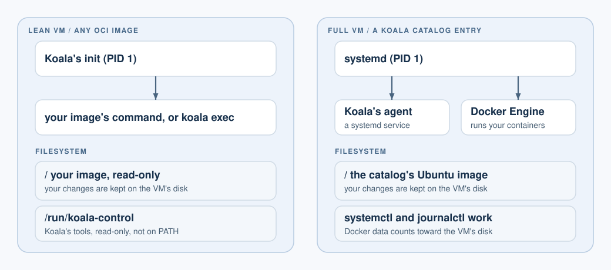

# Profiles: lean and full

[User guide](README.md) > Profiles

Every VM has a profile, fixed when it is created.

| | Lean | Full |
| --- | --- | --- |
| What boots | Koala's small init, then your image's command | systemd, with Koala's agent as a service |
| Image source | Any `linux/arm64` OCI image | A Koala catalog entry |
| `systemctl`, `journalctl` | Not available | Available |
| Docker Engine | No | Yes (Docker and containerd) |
| Default resources | 1 vCPU, 256 MiB RAM, 1 GiB disk | 2 vCPUs, 1024 MiB RAM, 8 GiB disk |
| Good for | Jobs, single services, quick tools | Development boxes, Docker, multi-service setups |



OCI images run in the lean profile, and catalog entries in the full profile.
Any other pairing, such as `--profile full` with an OCI image, fails with
`IMAGE_INCOMPATIBLE`. The profile of an existing VM cannot be changed.

## Full VMs

A full VM comes from a catalog entry:

```sh
koala volume create dev-data --size 1GiB --wait
koala create dev --catalog CATALOG_ENTRY --volume dev-data:/data --mount "$PWD/src:/src:ro" --wait
koala start dev --wait          # returns once systemd and Docker are ready
```

**Not available yet:** the signed Koala catalog, with its versioned full
image, is not published; the preview has the lean runtime only. Until then there is no public catalog entry to
use. The full profile was tested with a test catalog entry.

Commands run inside systemd's environment, as root by default:

```sh
koala exec dev -- systemctl is-system-running --wait
koala exec dev -- systemctl is-active docker containerd
koala exec dev -- journalctl -u docker -n 20 --no-pager
koala exec -it dev -- /bin/sh
```

## Docker

Docker Engine runs inside the full VM. You do not need Docker Desktop.

```sh
koala cp rootfs.tar dev:/tmp/rootfs.tar
koala exec dev -- docker import /tmp/rootfs.tar local/tool:1
koala exec dev -- docker run --rm --network none local/tool:1 /bin/busybox echo ok
koala exec dev -- docker run -d --name ticker --network none local/tool:1 /bin/busybox sleep 600
```

What is tested:
importing an image and running containers with `--network none`, in the
foreground and detached. Pulling images from a registry inside the VM, and
container networking, are not part of the tested journey yet.

Things to know:

- Docker's data is stored on the VM's own disk and counts toward its
  `diskMiB`.
- Containers do not see Koala volumes or shares through `docker run -v
  /data:...`: that path refers to the VM's own `/data`, not the attached
  volume.
- A tar file made on macOS may carry extended attributes that Docker
  refuses (`com.apple.provenance`). Create it with
  `COPYFILE_DISABLE=1 tar --no-xattrs --no-mac-metadata ...`.
- In an interactive shell, `tty` prints `not a tty`. See
  [interactive shells](working-in-vms.md#interactive-shells-and-detaching).

## Lean VMs

The lean profile starts your image's command directly; there is no service
manager. It is the default for OCI images and the profile `koala run` uses.
Use a service-mode VM for a long-running program, or an environment-mode VM
plus `koala exec` for ad-hoc commands. See [jobs and VMs](vms.md).

Inside a lean VM, the filesystem is your image's: its files and programs
are where the image puts them. What you change outside volumes and shares is
kept on the VM's disk, so it survives a stop and start of an environment or
service VM. A job's disk is removed with the job.

- Koala's own tools are mounted read-only at `/run/koala-control`. They are
  not on `PATH`, and you don't need to call them.
- `koala exec` runs a program from the image. An image without a shell, such
  as `scratch` or a distroless image, can only run the programs it contains.
- In a lean VM, `--user` takes numeric IDs (`--user 1000` or
  `--user 1000:1000`). User names from the image's `/etc/passwd` are not
  looked up yet, and that includes a named user set in the image.
