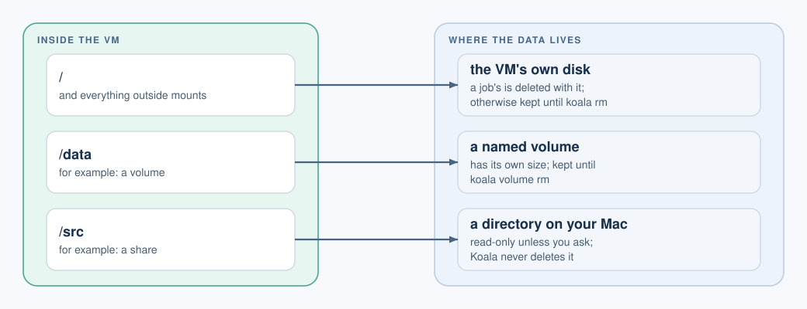

# Shares, volumes and disks

[User guide](README.md) > Shares, volumes and disks

A VM can store data in three places:

| Where | What it is | Lifetime | Counted in `diskMiB` |
| --- | --- | --- | --- |
| The VM's own disk | The image's files plus everything the VM writes elsewhere | A job's is deleted with it; a persistent VM's lasts until `koala rm` | Yes |
| A named volume | A separate disk you create and attach | Until you run `koala volume rm` | No (it has its own size) |
| A host share | A directory on your Mac, shared into the VM | It is your directory; Koala never deletes it | No |



## Share a host directory

```sh
koala create dev --image docker.io/library/alpine:3 --mount "$PWD/src:/src" --wait          # read-only
koala create dev2 --image docker.io/library/alpine:3 --mount "$PWD/out:/out:rw" --wait      # read-write
```

In a spec file:

```json
"shares": [
  {"source": "/Users/me/project/src", "destination": "/src", "readOnly": true},
  {"source": "/Users/me/project/out", "destination": "/out", "readOnly": false}
]
```

- **Shares are read-only unless you ask.** A read-only share stays read-only
  whatever the guest does, even as root.
- `--mount` resolves the host path for you. In a spec file, write the
  directory's real path exactly as macOS stores it: absolute, no symlinks,
  no `..`, and the right upper/lower case.
- The directory must be readable by you. A read-write share must also be
  owned by you, and not writable by your group or others.
- You cannot share a directory that contains Koala's own state.
- **Every start re-checks the directory.** If it was renamed, replaced, made
  a symlink, or changed owner or permissions, the start fails with
  `GRANT_REQUIRED`. Koala never re-approves a share by itself: stop the VM,
  then `koala update` it with the directory you mean.

### Treat a writable share as untrusted output

A read-write share lets the program in the VM create any file there,
including symlinks that point elsewhere on your Mac, such as `~/.ssh`. Your
editor, build tools or backup software may later follow those links with
your permissions. So:

- Share source code read-only.
- Give write access only to a dedicated output directory.
- Check what the VM wrote before your tools act on it.

## Named volumes

A volume is a fixed-size disk that outlives the VMs that use it.

```sh
koala volume create data --size 1GiB --wait      # 128 MiB to 1 TiB; a bare number means MiB
koala volume list                                # name, state, capacity, used, attachments
koala create dev --image docker.io/library/alpine:3 --volume data:/data --wait
koala volume rm data --wait
```

- `--volume NAME:/path` is read-write by default; add `:ro` for read-only.
- A volume can be written by only one VM at a time.
- `koala rm VM` never removes its volumes. A new VM can attach the same
  volume and find the data unchanged.
- `volume rm` is refused while any VM refers to the volume, even a stopped
  one. Remove the VM first.
- In a full VM, Docker containers do not see the volume through
  `docker run -v /data:...`. See [profiles](profiles.md#docker).

## Copy instead of share

To move files without granting a directory, use
[`koala cp`](working-in-vms.md#copy-files-koala-cp).

## Disk sizes

`diskMiB` is the size of the VM's own disk as the guest sees it. The file
on your Mac grows only as data is written. Volumes and shares are not
included. See [limits](limits.md#memory-cpu-and-disk) for what happens when
your Mac runs low on space.
