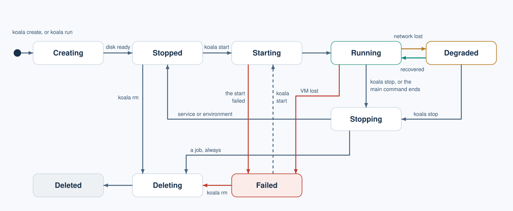

# Jobs and VMs

[User guide](README.md) > Jobs and VMs

## Three modes

Every VM has a *mode*, chosen when it is created:

| Mode | What runs | When the main command ends | Typical use |
| --- | --- | --- | --- |
| `job` | One command | The VM stops and is removed automatically | Builds, tests, one-off tasks |
| `service` | The image's command, or one you give | The VM stops; its disk and definition are kept | A web server or daemon |
| `environment` | Nothing by default; you use `koala exec` | Nothing: it has no main command | A development box |

Service and environment VMs are *persistent*: they keep their disk across
stops and starts until you remove them. Closing your terminal never stops a
VM.

## Disposable jobs: `koala run`

```sh
koala run --image docker.io/library/alpine:3 -- /bin/sh -c 'echo building; exit 3'
echo $?     # 3
```

Options:

| Option | Meaning |
| --- | --- |
| `--image REF` | The image (required). |
| `--timeout S` | Kill the command after `S` seconds (1 to 86400). Exit status 124. |
| `--cpus N`, `--memory MiB`, `--disk MiB` | Resources. Defaults for `run`: 1 vCPU, 512 MiB RAM, 1024 MiB disk. |
| `-i` | Send your stdin to the command. |
| `-t` | Give the command a terminal. Use `-it` for an interactive program. |
| `--detach` | Print the job's IDs and return at once; the job keeps running. |
| `--result-file PATH` | Write the result as JSON (mode 0600). |
| `--json` | With `--detach` or `--result-file` only: print JSON on stdout. |

`--rm` is accepted for familiarity and changes nothing: a job's VM is
always removed after it stops.

While attached, Ctrl-C cancels the job (exit status 130). A detached job is
picked up again with `koala attach`:

```sh
koala run --detach --json --image docker.io/library/alpine:3 -- /bin/sh -c 'sleep 5; echo done'
# prints {"executionId": "...", "vmId": "...", "runId": "...", ...}
koala attach --no-stdin EXECUTION_ID
```

The VM's ID is useful while the job runs, for example to copy files in and
out. Exit statuses are listed in
[working inside a VM](working-in-vms.md#exit-statuses).

## Persistent VMs from flags: `koala create NAME`

```sh
koala volume create data --size 256MiB --wait
koala create box --image docker.io/library/alpine:3 --cpus 1 --memory 512 --disk 1024 \
  --publish 8080:8080 --volume data:/data --mount "$PWD:/workspace" --wait
koala start box --wait
```

| Option | Meaning |
| --- | --- |
| `--image REF` | An OCI image. |
| `--catalog NAME` (or `--image catalog:NAME`) | A Koala catalog entry (see [profiles](profiles.md)). |
| `--mode job\|service\|environment` | Default: `environment`. |
| `--profile lean\|full` | Default: lean for an OCI image; a catalog entry chooses its own. |
| `--cpus N`, `--memory MiB`, `--disk MiB` | Resources. See below. |
| `--publish [ADDR:]HOSTPORT:GUESTPORT[/tcp\|/udp]` | Publish a port ([networking](networking.md#publish-a-port)). Repeatable. |
| `--volume NAME:/guest/path[:ro\|:rw]` | Attach a named volume, read-write by default ([storage](storage.md#named-volumes)). Repeatable. |
| `--mount /host/dir:/guest/path[:ro\|:rw]` | Share a host directory, read-only by default ([storage](storage.md#share-a-host-directory)). Repeatable. |

Before submitting, `create` prints on stderr every port, volume and share
the VM will get, so you can see what you are granting.

VM names start with a lower-case letter, then use lower-case letters,
digits and `-` (at most 63 characters).

Flags cannot set a service's command, environment variables, network
grants or secrets. Use a spec file for those.

## Persistent VMs from a spec file: `koala create -f`

A spec file is JSON. Example `web.json`, a busybox web server that serves a
read-only host directory and keeps data in a named volume:

```json
{"apiVersion": "koala.dev/v1alpha1", "kind": "VirtualMachine", "spec": {
  "name": "web", "mode": "service", "profile": "lean",
  "image": {"kind": "oci", "reference": "docker.io/library/busybox:latest", "platform": "linux/arm64"},
  "resources": {"vcpus": 1, "memoryMiB": 512, "diskMiB": 1024},
  "process": {"arguments": ["/bin/busybox", "httpd", "-f", "-p", "8080", "-h", "/srv"]},
  "network": {"internet": false, "allow": [],
              "publish": [{"protocol": "tcp", "hostAddress": "127.0.0.1", "hostPort": 0, "guestPort": 8080}]},
  "shares": [{"source": "/Users/me/site", "destination": "/srv", "readOnly": true}],
  "volumes": [{"name": "site-data", "destination": "/data", "readOnly": false}],
  "secrets": []}}
```

```sh
koala config validate -f web.json      # checks the file without creating anything
koala volume create site-data --size 256MiB --wait
koala create -f web.json --wait
koala start web --wait
```

The fields, briefly:

| Field | Notes |
| --- | --- |
| `name`, `mode`, `image` | Required. `image.platform` is `linux/arm64`. |
| `profile` | `lean` or `full`. |
| `resources` | All three of `vcpus` (1–32), `memoryMiB` (128–131072), `diskMiB` (256–1048576), or omit it for the profile's defaults. |
| `process` | `entrypoint`, `arguments`, `environment`, `workingDirectory`, `user`, `terminal`, `timeoutSeconds`. Omitted fields use the image's defaults. |
| `network` | `internet`, `allow` (grants), `publish`. See [networking](networking.md). |
| `shares`, `volumes` | See [storage](storage.md). `readOnly` is required on each entry. |
| `secrets` | Named secret grants. See [secrets](secrets.md). |
| `labels` | Your own key/value notes. |

Rules worth knowing:

- Unknown fields, duplicate keys and wrong types are refused, with a
  pointer to the problem, for example `/spec/network/allow/0/ports`.
- Nothing is expanded: no environment variables, `~` or shell syntax. Host
  paths must be absolute.
- `-f -` reads the file from stdin.
- With `-f`, the `--publish`, `--volume` and `--mount` flags are refused: put
  them in the file.

## Resources and defaults

| How the VM is made | vCPUs | RAM | Disk |
| --- | --- | --- | --- |
| `koala run` without resource flags | 1 | 512 MiB | 1024 MiB |
| `create` or a spec file without resources, lean | 1 | 256 MiB | 1024 MiB |
| `create` or a spec file without resources, full | 2 | 1024 MiB | 8192 MiB |
| `create` with some resource flags | Missing values become 1 vCPU, 512 MiB, 1024 MiB | | |

What these numbers mean for your Mac is explained in
[limits](limits.md#memory-cpu-and-disk).

## Lifecycle commands

```sh
koala list                    # all VMs: ID, name, mode, state, spec generation
koala inspect VM              # summary, network state and published ports
koala inspect --json VM       # everything, including the resolved spec
koala start VM --wait
koala stop VM --wait          # returns once the VM has really stopped
koala rm VM --wait            # removes a stopped VM; named volumes are kept
koala stats VM                # the memory and disk the manager reserved for it
```



`koala run` goes through the same states without stopping at `Stopped`.
A job is removed whether its command succeeds or fails; a service or
environment VM keeps its disk until `koala rm`.

VM states you will see: `Creating`, `Stopped`, `Starting`, `Running`,
`Degraded` (running, but its network was lost; see
[networking](networking.md#after-a-manager-restart)), `Stopping`,
`TerminationUnknown`, `Failed`, `Deleting`, `Deleted`.

`koala stats` shows the reservations the manager made for the running VM.
Usage figures from inside the guest are not available yet.

## Change a VM: `koala update`

You change a persistent VM by replacing its spec while it is stopped. The
change applies at the next start.

```sh
koala inspect --export web > web.json    # the VM's current, fully resolved spec
# edit web.json
koala stop web --wait
koala update web -f web.json --wait      # prints the new grants, then applies them
koala start web --wait
```

- `update` on a running VM is refused (`INVALID_STATE`).
- `update` replaces the whole spec with the file's content, so start from a
  fresh `inspect --export`.
- The base image and the profile cannot be changed. Create a new VM instead.
- The exported file contains host paths. Check them before using it on
  another Mac.

## Runtime updates

`koala runtime update VM --bundle DIGEST [--rollback]` selects a different
verified kernel and init bundle for a stopped VM, without touching its
image or disk. Runtime bundles beyond the preview's lean runtime come with
the catalog, which is not available yet.
