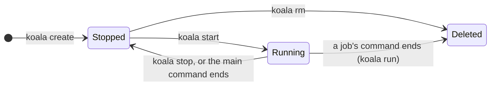
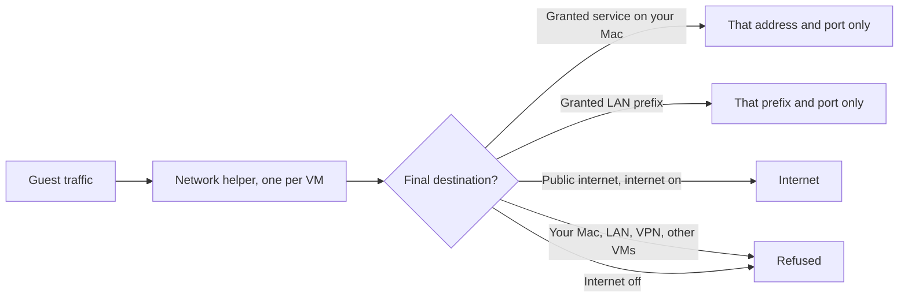
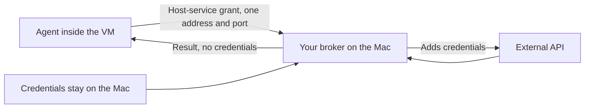

# How Koala works

This page explains Koala's moving parts and where its boundaries are, so you
can judge what a VM can and cannot do. For commands, see the
[user guide](guide/README.md).

## The pieces

Koala is a few cooperating processes, all running as **you**, the logged-in
macOS user. None of them runs as root.

| Piece | What it does | What it can touch |
| --- | --- | --- |
| **`koala` CLI** | Parses commands, prints output, attaches your terminal | The manager's private socket, and files you explicitly copy or share |
| **Manager** (`koala-manager`, launchd agent `dev.koala.manager`) | Keeps VM definitions and state, pulls images, admits new VMs against limits, starts and supervises VMs | Koala's state directory, your login keychain entries for Koala, and the helpers it starts |
| **VM worker** (one per running VM) | Runs one virtual machine with Apple's Virtualization framework, streams commands and logs | That VM's disks, its granted folders and its own sockets; no network, no registry credentials |
| **Network helper** `koala-net` (one per running VM) | The VM's entire network: DHCP, DNS, every TCP and UDP flow, published ports | Network sockets only; no disks, no secrets. Runs in the App Sandbox |
| **Image extractor** | Turns verified image layers into a Linux disk image | Only the files the manager hands it; no network, no keychain. Runs in the App Sandbox |
| **Guest agent** (inside the VM) | Starts processes, terminals and file transfers in the guest | The guest only. Everything it says is treated as untrusted |

The CLI talks to the manager over HTTP and WebSocket on a Unix socket that only
your user can open. There is no TCP control port. The manager is started on
demand by launchd, so there is nothing to keep running yourself.

## One VM per workload

Each job, service or environment gets its own ARM64 Linux VM with:

- **its own Linux kernel**, supplied by Koala's verified runtime bundle (an
  image provides the filesystem and defaults, not the kernel);
- **its own writable disk**, cloned from a shared, read-only prepared image,
  so VMs never write to each other's files;
- **its own network stack**, in its own helper process. There is no shared
  bridge between VMs, so one VM cannot see or spoof another.

A VM is either *lean*, which runs one OCI image with a minimal init, or
*full*, which runs a Linux distribution with systemd and Docker Engine. See
[profiles](guide/profiles.md).

The diagram leaves out the in-between states (`Creating`, `Starting`,
`Stopping`, `Deleting`); [jobs and VMs](guide/vms.md#lifecycle-commands) lists
them all. Jobs are removed when their command ends. Services and environments keep
their disk across stops and starts until you remove them. A VM keeps running
when you close your terminal, but **not** when you log out or restart your
Mac. See [limits](guide/limits.md).

## Images

When you create a VM from an image, the manager:

1. resolves the reference to its `linux/arm64` variant, using your registry
   login if one is needed;
2. downloads the manifest and layers over TLS and checks every size and
   digest;
3. hands the verified layers to the sandboxed extractor, which builds an ext4
   disk image without mounting anything on your Mac and without running any
   code from the image;
4. **pins the image digest** in the VM's definition, so a tag that moves
   upstream never changes an existing VM.

Prepared images are cached and shared between VMs, so a second VM from the
same image starts without downloading. Koala does not build Dockerfiles. See
[images](guide/images.md).

## Networking: checked on the Mac side

Every packet a VM sends goes to its own network helper on the Mac. The helper
decides, per connection and on the **final destination address**, whether to
let it through. Nothing in the guest, not even root, can change those rules,
because they are not inside the guest.

- The rules are fixed when a VM starts. To change them, stop the VM, update
  its spec and start it again.
- "Internet" means public addresses only. Your local networks and VPN ranges
  count as local even if their addresses look public, and stay blocked.
- When your Wi-Fi, VPN or routes change, new connections pause until the
  helper has re-checked what is local; ones that are no longer allowed are
  closed. If in doubt, it refuses.
- Published ports listen on `127.0.0.1` unless you ask for the LAN.

See [networking](guide/networking.md).

## Files, volumes and secrets

- **Shared folders** reach the VM through VirtioFS, read-only unless you ask
  for read-write. Treat anything a VM writes into a share as untrusted output.
  See [storage](guide/storage.md).
- **Named volumes** are disks that outlive a VM, for data you want to keep.
- **`koala cp`** copies files in and out without sharing a folder at all.
- **Secrets** live in your login keychain. A VM gets a secret only if its
  spec names it, either as a root-only file in memory (never on the VM's
  disk) or as an environment variable. Values never appear in specs, logs,
  process arguments or command output. See [secrets](guide/secrets.md).

### Agents without credentials

For an AI agent or another tool you do not fully trust, you can keep
credentials out of the VM entirely. Run a small service on your Mac (a
*broker*) that holds the credentials and performs only the actions you allow,
grant the VM that one service, and give it no secrets:

Koala does not ship a broker yet; this is a pattern you can use today with
any small HTTP service. The [Hermes example](guide/example-hermes.md) shows an
agent running in a VM with only the access it is granted.

## The trust model

Koala **trusts** you, the logged-in macOS user, and macOS itself.

Koala **does not trust** anything inside a VM: guest root, the guest kernel,
image contents, and every message from the guest agent. Access controls sit
outside the guest, in separate host processes, where a compromised guest
cannot switch them off. The network helper and image extractor run in the App
Sandbox, and each VM worker runs under a per-VM sandbox profile that allows
only that VM's files.

Koala does **not** promise:

- protection from a compromised macOS or its hypervisor, or from yourself;
- that data a guest has already received can be taken back; removing a share
  or a secret stops only future access;
- that a VM keeps running across logout or restart;
- dedicated CPU cores, or a cap on the Mac's total memory use.

!!! warning "Preview"

    Adversarial-guest security testing is complete. Crash and endurance
    qualification, planned for release, is not finished yet. Use Koala with
    workloads and on machines you trust until v0.1 is released.
